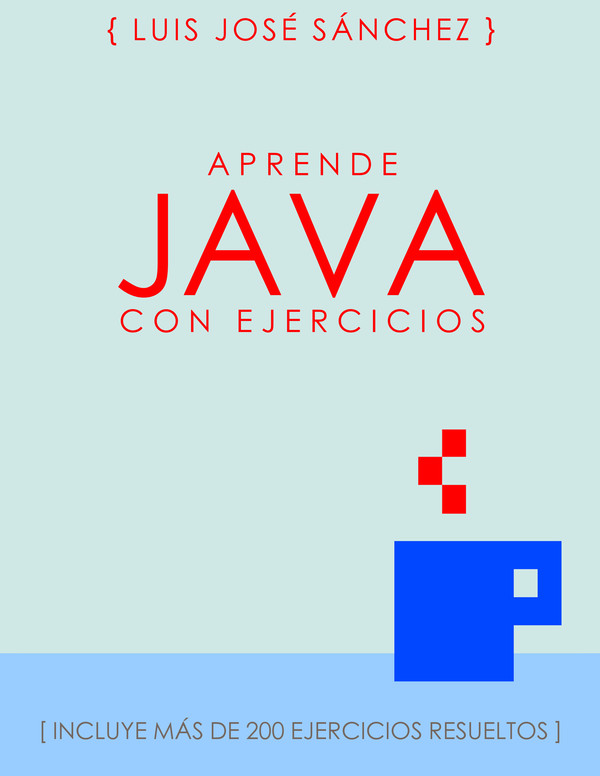

# Ejercicios de Programación de 1º DAM.
Ejercicios de la asignatura Programación. **1º DAM (Desarrollo de Aplicaciones Multiplataforma)** de IES Campanillas.

## ¿Qué se aprende en Programación?

* Comandos de Linux :penguin:
* Git y GitHub :octocat:
* Lenguaje Java :coffee: : variables, bucles, POO (Programación orientada a objetos), etc.

## "HolaMundo" en Java

A continuación se muestra el programa "Hola Mundo" escrito en Java.
```
/* Hola mundo! Muestro en pantalla el mensaje "Hola me llamo Salva!"
 */
 

public class HolaMundo {
  public static void main(String[] args) {
    System.out.print ("Hola me llamo Salva!");
  }
}
```

Para compilar el programa teclea:
```
javac HolaMundo.java
```


## :books: Bibliografía



[Aprende Java con Ejercicios](https://leanpub.com/aprendejava)

## Enlaces de interés

* [Página oficial del IES Campanillas](http://iescampanillas.com/)
* [Guía de la asignatura Progrmación](https://github.com/LuisJoseSAnchez/programacion)